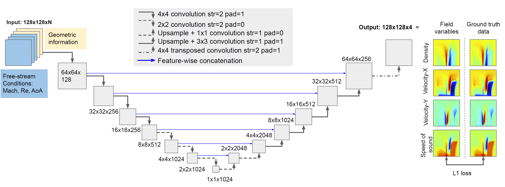
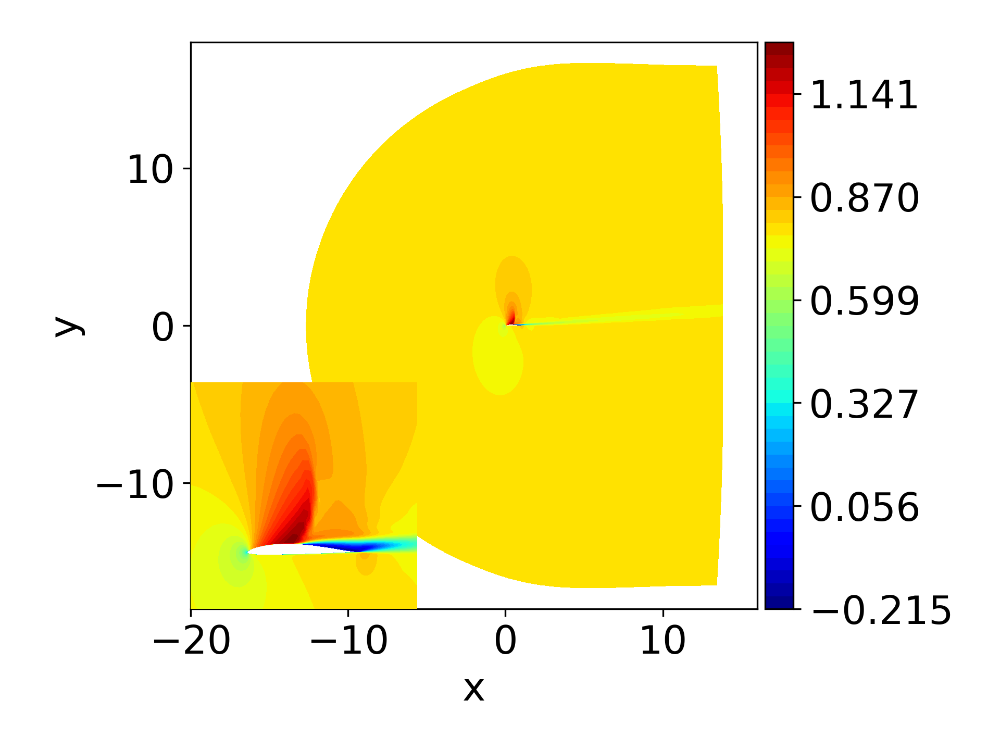
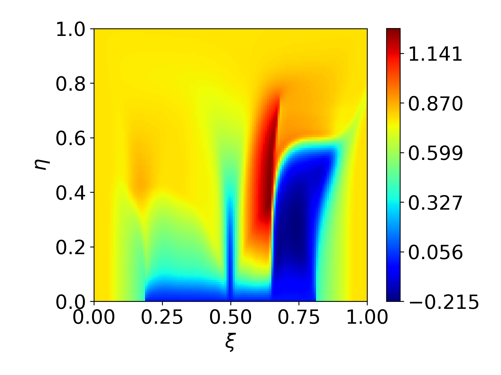
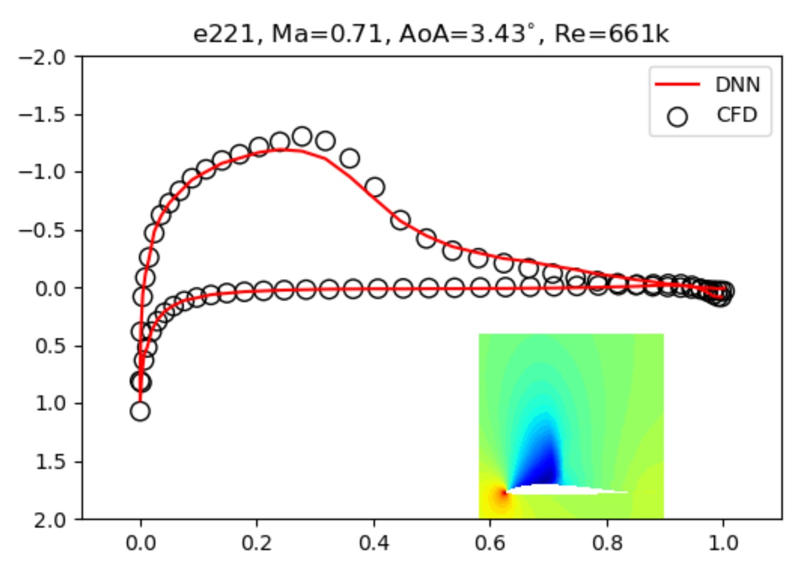
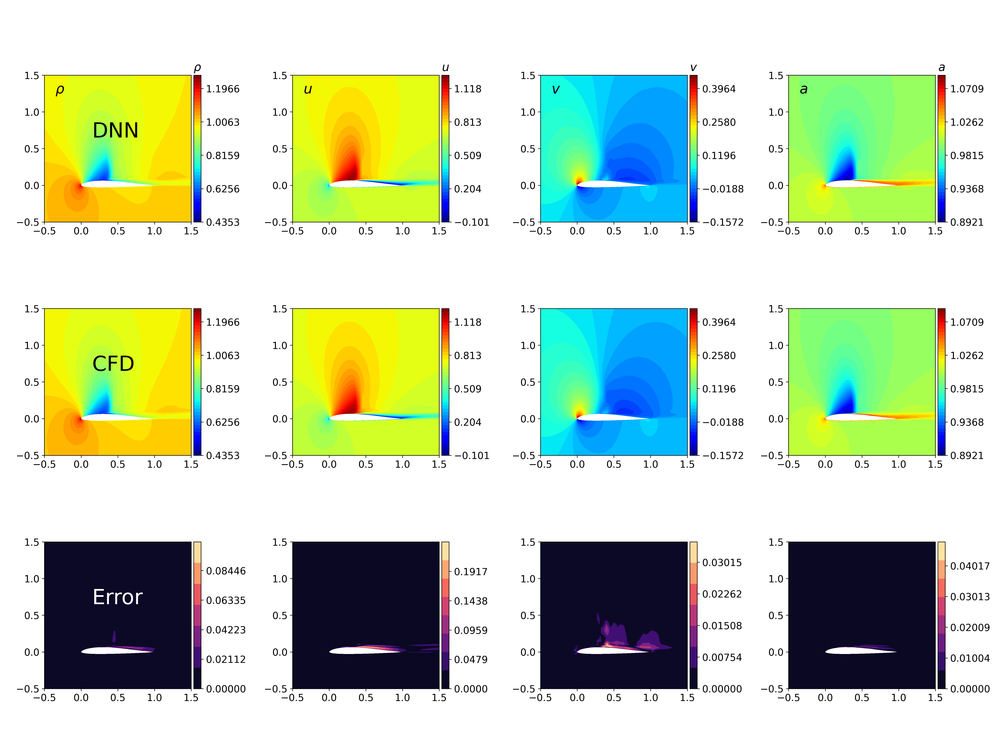

# Towards high-accuracy deep learning inference of compressible turbulent flows over aerofoils: Coordinate Transformation Encoding with Matrices
This is the source code for the paper ["Towards high-accuracy deep learning inference of compressible turbulent flows over aerofoils"](https://doi.org/10.1016/j.compfluid.2022.105707) by Liwei Chen and Nils Thuerey.

Additional information: [lab page](https://ge.in.tum.de/)

## Abstract:
The present study investigates the accurate inference of Reynolds-averaged Navier-Stokes solutions for the compressible flow over aerofoils in two dimensions with a deep neural network. Our approach yields networks that learn to generate precise flow fields for varying body-fitted, structured grids by providing them with an encoding of the corresponding mapping to a canonical space for the solutions. We apply the deep neural network model to a benchmark case of incompressible flow at randomly given angles of attack and Reynolds numbers and achieve an improvement of more than an order of magnitude compared to previous work. Further, for transonic flow cases, the deep neural network model accurately predicts complex flow behaviour at high Reynolds numbers, such as shock wave/boundary layer interaction, and quantitative distributions like pressure coefficient, skin friction coefficient as well as wake total pressure profiles downstream of aerofoils. The proposed deep learning method significantly speeds up the predictions of flow fields and shows promise for enabling fast aerodynamic designs.

# Data Generation

**Requirements**

- [CFL3D Version 6.7](https://nasa.github.io/CFL3D/) for data generation. The official source code is [here](https://github.com/NASA/CFL3D), but we have [our own repo with some changes](https://github.com/Hypersonichen/CFL3D).
- [Construct2D](https://sourceforge.net/projects/construct2d/) Note: we found "gfortran 9.4.0" causes problems so eventually used "gfortran 7.5.0" to build the executable code. Note also that one should use python2.7 to run the visualization script provided by Construct2D, e.g. `python2.7 postpycess.py`.
- [PyTorch](https://pytorch.org/) *tested with "1.6.0", with "1.10.2", with "1.11.0+cu113"*. We recommend installing via conda, e.g., with `conda install pytorch torchvision torchaudio cudatoolkit=11.3 -c pytorch`. 

**Build CFL3D**

Clone the NASA's CFL3D code to your local computer: 

`git clone https://github.com/Hypersonichen/CFL3D.git`

`cd CFL3D/build/`

`./setup.sh`

In the current project, we only use the serial version "cfl3d_seq" in the folder "CFL3D/build/cfl/seq/".

**Mesh Generation**

`cd mesh_generation`

Step 0:
`./Step-0_prep.sh`

Step 1:
Modify Line #11 in "Step-1_script_meshing_v2.sh" with the correct path (where construct2d is installed), and run

`./Step-1_script_meshing_v2.sh` 

(Note: the script calls "construct2d". It might take minutes generating 1500 mesh files. According to the data files for aerofoil coordinates, if the training edge is sharp, the script generates C-type grids; if blunt, it writes O-type grids. The output files are *.p3d, *_stats.p3d and *.nmf files.)

Step 2:

`./Step-2_check_otype.sh` (Note: this step checks o-type mesh files, and moved those into the folder "o-mesh_raw".)

Step 3:

`./Step-3_conv_for_cfl3d_plot3dgrid.sh` (Note: because "construct2d" uses ASCII plot3d format, we need to translate the ASCII files into unformated binary format for NASA's cfl3d code. We only need *.bin files for the simulation.)


**Simulation with CFL3D**

In this tutorial, we are going to reproduce the transonic case with "Method C" and 1940 training samples. 

`cd BASIC_simulations/`

`./prep.sh`

Modify Line # 42 in "dataGen.py" and make sure the file path is correct (i.e. the location of "cfl3d_seq"). 

`python dataGen.py`

The script reads the cfl3d input template `input_template.inp` and replaces the user-defined keywords with specified values. In the current version, we run 15000 iterations, and then average the results over another 5000 iterations (see `input_template2.inp`). The final results, $\rho$, $\rho u$, $\rho v$, $\rho E$, are saved in npz format in the folder `train_avg`. The data are saved with `cell-center` type (i.e. iptype=1 in CFL3D).

Note that potentially we can use well-tuned multi-grid method to accelerate the simulation. Also, it is helpful to try one of the test cases from [CFL3D official website](https://nasa.github.io/CFL3D/), e.g. [steady flow over NACA0012](https://nasa.github.io/CFL3D/Cfl3dv6/cfl3dv6_testcases.html#n0012), in order to get familiar with the solver before running our script.


**Obtaining the metrics**

The ["metrics"](https://nasa.github.io/CFL3D/Cfl3dv6/V5Manual/GenCoor.pdf) contain geometrical information. As each aerofoil only has one mesh and there is no mesh deformation, we can ouput the coordinate transformation metrics as a separate post-processing task. (Warning: this is a special case. In many applications, we want to calculate metrics information using differentiable operators, e.g., in some unsteady projects where mesh deformation or aeroelasticity are involved, or sometimes we want to calculate metrics within layers" as the latent features can be considered as representions on coarser grids. Along this direction, we will update it in the up-coming tutorials and projects. For now, we provide some example codes in the sub-folder `differentiable_metrics` and the file `introduction.pdf`.) 

We want to re-build cfl3d (**warning: suppose we have copied the executable file "cfl3d_seq" built previously to somewhere, e.g. /usr/local/bin/, otherwise it will be overwritten!**)

`cd CFL3D/build/`

`make scruball` (note: this means all the previously-built files are deleted.)

`./metric_setup.sh` (we only use the serial version "cfl3d_seq" in the folder "CFL3D/build/cfl/seq/".)

`cd metric_generation`

`python metricGen.py` 

The script calls cfl3d_seq. Instead of running a flow simulation, it only reads mesh files and calculates "metrics", and then saves 7 variables, $J^{-1}$, $\hat{\xi}_x$, $\hat{\xi}_y$, $|\nabla \xi|/J$, $\hat{\eta}_x$, $\hat{\eta}_y$, $|\nabla \eta|/J$, $x_0$, and $y_0$ (i.e. [arrays `si4, sj1, sj3, sj4, sk1, sk3, sk4`](https://nasa.github.io/CFL3D/Cfl3dv6/V5Manual/GenCoor.pdf)).

`metrics:`
- si(1-3)...components of unit normal to i-face (directed area)
- si( 4 )...area of  i-face
- si( 5 ).. speed of i-face

- sj(1-3)...components of unit normal to j-face (directed area)
- sj( 4 )...area of  j-face
- sj( 5 ).. speed of j-face

- sk(1-3)...components of unit normal to k-face (directed area)
- sk( 4 )...area of  k-face
- sk( 5 ).. speed of k-face


**Re-shaping the data**

We will merge the flowfield data, metrics, and surface coordinates for training the U-net as shown in the below architecture:



`cd BASIC_simulations`

`mkdir ../BASIC_data_coordinates_final_metricsAll`

`mkdir ../BASIC_data_coordinates_final_metricsAll/train_avg` (the merged data will be put here.)

`python merge_coordinates_metricsAll.py`

Now the input data include $Ma_{\infty}$, $Re_{\infty}$, $\alpha_{\infty}$, $J^{-1}$, $\hat{\xi}_x$, $\hat{\xi}_y$, $|\nabla \xi|/J$, $\hat{\eta}_x$, $\hat{\eta}_y$, $|\nabla \eta|/J$, $x_0$, and $y_0$.

# Training 

We recommend using the pre-generated data for training.
- [Training set](https://drive.google.com/file/d/16z1ZL60yWyVfyvFU8Uq3SMVfMHEQkGJ_/view?usp=sharing) 2.24Gb. There are 970 aerofoils and each aerofoil case has two randomly-selected flow conditions, so totally we have 1940 flowfields.
- [Test set](https://drive.google.com/file/d/1fCYnhxfXicwxtlivItU6VJ_ltcuD51FI/view?usp=sharing) 23.7Mb. There are 20 aerofoils that haven't been seen in the training set; each has one flow condition, and totally we have 20 flowfields.

Download and extract the data. Then, make sure the sub-folders "train_avg" and "test_avg" are under the folder "BASIC_data_coordinates_final_metricsAll_1940".

`nohup python runTrain.py > output.log &` (Note: in Line 33 of "runTrain.py", if we use "expo=7", the number of trainable parameters is 30928388. Training runs 1290 epochs.)

One can also download the trained model as well as *pickle files [here](https://drive.google.com/file/d/1E7QC5BtwF0EI0r6OaUvB5qzDTLBLJwS2/view?usp=sharing), the random seed used in the model is "2125985365".

# Testing

Extract the "test_mesh.tar.gz".

Here we show the x-component velocity field over aerofoil “fx84w097” in the physical space and the corresponding distribution in the curvilinear coordinate system $(\xi$, $\eta)$:




`python cp_subplots.py` (pressure coefficient)



`python skinfriction_subplots.py` (skin friction coefficient)

The trained neural network yields results that resolve all necessary structures such as shocks, and has an average error of less than 0.3% for turbulent transonic cases. This is appropriate for real-world, industrial applications. Here’s are the inferred skin friction coefficent for ‘e221’:


The flow field of aerofoil “e221” at the test condition is characterised
by a strong standing shock wave and shock-induced separation. Here is the comparison of DNN and CFD results:



# Closing Remarks

If you find the approach useful, please cite our paper via:
```
article{CHEN2023105707,
title = {Towards high-accuracy deep learning inference of compressible flows over aerofoils},
journal = {Computers & Fluids},
volume = {250},
pages = {105707},
year = {2023},
issn = {0045-7930},
doi = {https://doi.org/10.1016/j.compfluid.2022.105707},
url = {https://www.sciencedirect.com/science/article/pii/S0045793022003000},
author = {Li-Wei Chen and Nils Thuerey},
keywords = {Deep learning, Neural network, Transonic flow},
abstract = {The present study investigates the accurate inference of Reynolds-averaged Navier–Stokes solutions for the two-dimensional compressible flow over aerofoils with a deep neural network. Our approach yields networks that learn to generate precise flow fields for varying body-fitted, structured grids by providing them with an encoding of the corresponding mapping to a canonical space for the solutions. We apply the deep neural network model to a benchmark case of incompressible flow at randomly given angles of attack and Reynolds numbers and achieve an improvement of more than an order of magnitude compared to previous work. Further, for transonic flow cases, the deep neural network model accurately predicts complex flow behavior at high Reynolds numbers, such as shock wave/boundary layer interaction, and quantitative distributions like pressure coefficient, skin friction coefficient as well as wake total pressure profiles downstream of aerofoils. The proposed deep learning method significantly speeds up the predictions of flow fields and shows promise for enabling fast aerodynamic designs.}
}
```

This work was supported by the ERC Consolidator Grant *SpaTe* (CoG-2019-863850).

